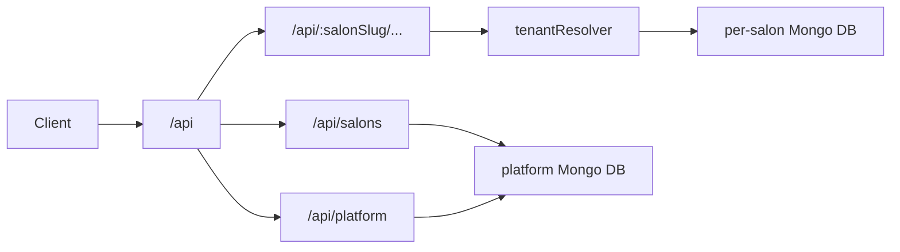

# barbershop-api

Express + MongoDB multi-tenant REST API for **hirnix** (BarberCRM) — barbershop booking and salon CRM.

Plain JavaScript (CommonJS). No TypeScript. The companion React frontend talks to this service via `VITE_API_URL` (default `http://localhost:5000/api`).

## Prerequisites

- Node.js (compatible with Express 5 and the dependencies in `package.json`)
- MongoDB (local instance or Atlas URI)
- A [Brevo](https://www.brevo.com/) account if you need outbound email locally (booking confirmations, reminders, password reset)

## Quick start

```bash
npm install
```

Create a `.env` file in the project root (see [Environment variables](#environment-variables)), then:

```bash
npm run dev
```

This starts the server with nodemon on port `5000` (or `PORT`).

- Health check: `GET /` → `BarberCRM API is running`
- Direct start without nodemon: `node server.js`

## Environment variables

| Variable | Required | Purpose |
|---|---|---|
| `MONGO_URI` | yes | Base MongoDB URI. The DB name in the URI is rewritten to `platform` or each salon's `dbName` (see `config/mongoUri.js`). |
| `JWT_SECRET` | yes | Signs salon user JWTs. |
| `PLATFORM_JWT_SECRET` | for platform admin | Signs platform admin JWTs. |
| `PLATFORM_ADMIN_SECRET` | for bootstrap | Shared secret required when creating the first platform admin. |
| `EMAIL_USER` | for email | Brevo sender email address. |
| `BREVO_API_KEY` | for email | Brevo HTTP API key (email is sent over HTTPS, not SMTP). |
| `FRONTEND_URL` | recommended | Base URL for password-reset links, salon invitation links, and email logo assets. |
| `PORT` | no | HTTP port (default `5000`). |
| `DISABLE_REMINDER_JOB` | no | Set to `true` to skip the 24h appointment reminder cron. |

Example `.env`:

```env
MONGO_URI=mongodb://127.0.0.1:27017/barbershop
JWT_SECRET=change-me
PLATFORM_JWT_SECRET=change-me-platform
PLATFORM_ADMIN_SECRET=change-me-bootstrap
EMAIL_USER=noreply@example.com
BREVO_API_KEY=
FRONTEND_URL=http://localhost:5173
PORT=5000
# DISABLE_REMINDER_JOB=true
```

## Architecture



- **Platform DB** (`platform`): salon registry (`Salon`), invitations (`Invitation`), platform admins (`PlatformAdmin`). Connected at startup via `config/db.js`.
- **Tenant DBs**: one Mongo database per salon. Connections are created on demand and cached in `config/tenantDb.js`; models come from `models/registry.js`.
- **`tenantResolver`**: resolves `:salonSlug` to an active salon, then attaches `req.tenant` and `req.models`.
- **`verifyToken`**: Bearer JWT for CRM routes; rejects tokens whose `salonId` does not match the resolved tenant (`TENANT_MISMATCH`).
- **Public booking**: `/api/:salonSlug/booking` (no JWT).
- **Email**: Brevo HTTP API (`config/mailer.js`). Failures are logged; bookings still succeed if email fails.
- **Reminders**: `node-cron` job every 15 minutes (`config/reminderJob.js`) sends one email ~24h before a scheduled appointment (per-salon timezone).

Route handlers talk directly to Mongoose models — there is no separate service/controller layer.

## API surface

Auth header for protected routes:

```http
Authorization: Bearer <token>
```

### Non-tenant mounts

| Prefix | Auth | Notes |
|---|---|---|
| `/api/salons` | public | Invitation lookup, salon registration |
| `/api/platform` | platform JWT (most routes) | Platform admin login, salon lifecycle, invitations. Bootstrap admin creation is gated by `PLATFORM_ADMIN_SECRET`. |

### Tenant mounts (`/api/:salonSlug/...`)

| Path | Auth | Notes |
|---|---|---|
| `/auth` | mixed | Login, forgot/reset password are public; `register`, staff updates, and `/me` require JWT |
| `/booking` | public | Services, employees, settings, available slots, create booking |
| `/clients` | JWT | CRUD + Excel import/export |
| `/employees` | JWT | CRUD, deactivate/reactivate + Excel import/export |
| `/appointments` | JWT | CRUD, notes + Excel import/export |
| `/services` | JWT | CRUD + Excel import/export |
| `/categories` | JWT | CRUD |
| `/reviews` | JWT | List/create/delete; updates employee rating aggregates |
| `/settings` | JWT | Shop settings singleton + change password |
| `/notifications` | JWT | List / mark read |
| `/analytics` | JWT | `/dashboard`, `/forecast`, `/rfm` |

`requests.rest` is a local HTTP scratchpad; some examples may still use older pre-tenant paths.

## Scripts

| Command | Description |
|---|---|
| `npm run dev` | Start with nodemon (`server.js`) |
| `node server.js` | Start without nodemon |
| `node seed.js --salon=<slug>` | Wipe and seed demo users, employees, clients, services, appointments, reviews, and settings for an **existing** salon |
| `node scripts/registerFirstTenant.js --slug=<slug> --name="<Name>" [--dbName=barbershop] [--ownerEmail=...]` | Register an existing Mongo DB as the first salon in the platform registry (does not copy data) |
| `node scripts/migrateEmployeeSchedule.js` | One-off employee schedule migration |

There is no real test suite — `npm test` is a placeholder that exits with an error.

## Project structure

```
├── config/           # DB, tenant connections, mailer, reminder cron
├── middleware/       # tenantResolver, verifyToken, platform admin, uploads
├── models/           # Tenant schemas + models/platform/* (Salon, Invitation, PlatformAdmin)
├── routes/           # One router per resource
├── scripts/          # One-off migrations / bootstrap helpers
├── utils/            # Timezone, currency, Excel, Google Calendar links, errors, etc.
├── server.js         # App entrypoint
├── seed.js           # Demo data seeder
└── package.json
```

## Conventions

- Many user-facing error messages and email templates are in Ukrainian.
- Validation is ad hoc per route (no Joi/Zod/express-validator).
- No global error-handling middleware — each handler has its own `try/catch`.
